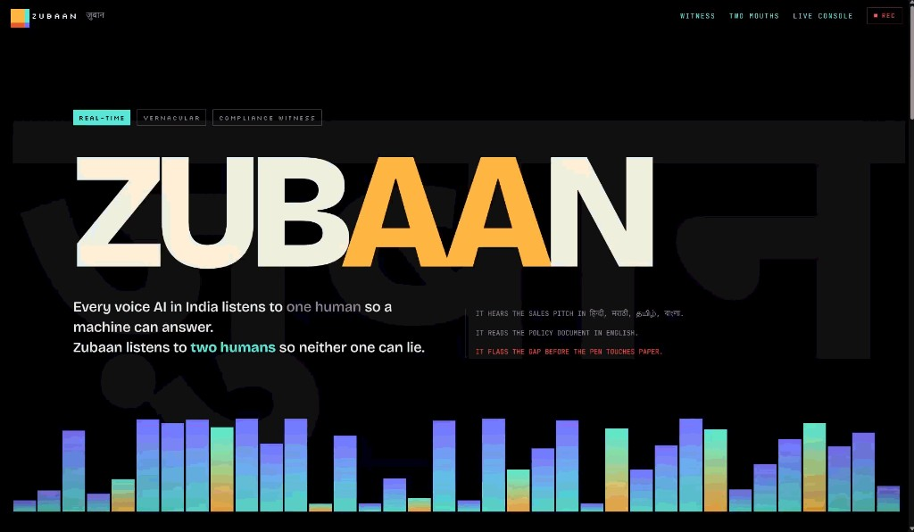
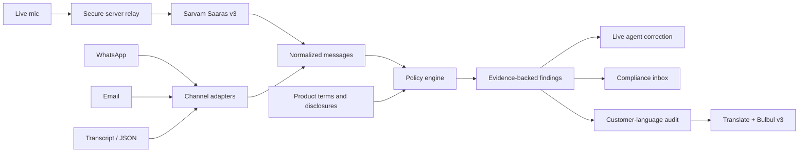

# Zubaan

### The vernacular compliance witness for financial conversations

Zubaan listens to what an agent promises, checks it against the written product
terms, and creates an evidence-backed record before the customer signs.

**[Live demo](https://zubaan1.vercel.app)** ·
**[Live workspace](https://zubaan1.vercel.app/call)** ·
**[Import a conversation](https://zubaan1.vercel.app/import)**



> Every voice AI listens to one human so a machine can answer.<br>
> **Zubaan listens to two humans so neither one can lie.**

Zubaan is not another customer-service assistant. An assistant serves whoever
is holding it; a witness serves the record.

---

## Why we built it

Financial products in India are usually documented in English, but they are
often sold in Hindi, Marathi, Tamil, Bengali, and code-mixed speech.

That creates a dangerous gap:

1. A policy document says returns are market-linked.
2. An agent says, “12% guaranteed return milega.”
3. The customer hears the promise, not the clause.
4. A complaint appears weeks or months later.
5. Compliance teams have a recording, but not a structured explanation of the
   exact contradiction, its evidence, or who made it.

Traditional quality assurance samples a small percentage of calls and reviews
them after the sale. Generic call summaries can explain what was discussed, but
they do not establish whether a claim was supported by the governing product
document.

Zubaan turns the conversation into a policy-grounded evidence trail:

- **what the agent said;**
- **what the customer asked;**
- **what the written terms say;**
- **which claim contradicts which clause;**
- **which mandatory disclosure was omitted;**
- **what the agent should say instead;**
- **what the customer should hear in their own language before signing.**

## Problem statement

> Build a real-time, multilingual conduct-risk layer for financial distribution
> that detects unsupported promises and missing disclosures across voice and
> text channels, while preserving reviewable evidence.

The initial wedge is insurance and bancassurance, especially products such as
ULIPs where returns, liquidity, charges, lock-ins, exclusions, and free-look
periods are easy to misrepresent.

The same evidence model can extend to lending, mutual funds, wealth products,
support quality, privacy disclosures, and escalation obligations.

## What Zubaan does

### During a live call

- Captures vernacular and code-mixed speech through Sarvam Saaras v3.
- Buffers speech into windows instead of sending one model request per word.
- Checks claims such as guaranteed return, lock-in, liquidity, and charges.
- Shows a red finding with:
  - **You said**
  - **Document says**
  - **Say instead**
- Tracks satisfied disclosures throughout the conversation.

### At the end of a call

- Compares required disclosures with what was actually said.
- Produces omission findings for missing items such as the free-look period.
- Creates a customer-facing audit summary.
- Translates the summary into the customer’s language.
- Can generate a vernacular voice receipt using Sarvam Bulbul v3.

### Across non-voice channels

Zubaan normalizes the following into the same conversation and evidence model:

- pasted or uploaded transcripts;
- WhatsApp exports;
- email;
- support and sales text;
- generic JSON events.

The result is one compliance inbox instead of a separate review tool for every
channel.

## Product surfaces

| Route | Purpose |
| --- | --- |
| `/` | Product narrative, interactive morph, and animated witness console |
| `/call` | Stage replay and live-mic compliance workspace |
| `/import` | Transcript, WhatsApp, email, and JSON ingestion |
| `/inbox` | Omnichannel review queue |
| `/conversations/[id]` | Messages, findings, and linked evidence |
| `/compliance` | Agent, language, contradiction, and omission overview |
| `/product` | Product terms and disclosure sources |
| `/connectors` | Connector roadmap and setup surface |
| `/audit/[id]` | Customer-facing “before you sign” audit |
| `/api/health` | Provider, storage, pool, and relay health |

## Demo in four minutes

### 1. Establish the category

Open the [landing page](https://zubaan1.vercel.app) and say:

> “The contract is in English. The promise is not. Zubaan hears both sides and
> keeps the receipt.”

Scroll through:

- **The Morph** — spoken claim versus written clause;
- **Two Mouths, One Ledger** — agent, customer, and witness;
- **Live Console** — transcript, document anchors, risk, and witness log.

### 2. Show the live-call workflow

Open `/call`, select **Stage**, and start recording.

The deterministic demo intentionally includes:

- a guaranteed-return claim against a market-linked product;
- a false liquidity or lock-in claim;
- a missing free-look disclosure.

End the call and open the customer audit.

Stage mode is the recommended investor-demo path because it has no microphone,
provider, network, or serverless-affinity dependency.

### 3. Show omnichannel compliance

Open `/import`, choose **WhatsApp export**, set the agent name to `Meera`, and
paste:

```text
26/07/2026, 10:31 - Meera: Namaste ma'am, guaranteed 12% return milega har saal.
26/07/2026, 10:32 - Sunita: Lock-in kitna hai?
26/07/2026, 10:32 - Meera: Koi lock-in nahi, kabhi bhi withdraw kar sakti hain.
26/07/2026, 10:33 - Sunita: Charges aur free-look?
26/07/2026, 10:33 - Meera: Koi charge nahi. Aaj hi sign kar dete hain.
```

Import it, open the conversation, and show the findings tied to individual
messages.

### 4. Close with the product thesis

> “We do not answer the customer. We preserve what the agent promised, compare
> it with what the product permits, and intervene before signature.”

## How it works



### Model split

| Stage | Sarvam capability | Why |
| --- | --- | --- |
| Streaming transcription | `saaras:v3` | Indic speech, code-mix, language detection, VAD |
| Live contradiction check | `sarvam-30b` | Faster model for call-window checks |
| End-of-call audit | `sarvam-105b` | Deeper reasoning over omissions and summary |
| Translation | `sarvam-translate:v1` | Customer-language audit |
| Voice receipt | `bulbul:v3`, speaker `priya` | Calm vernacular TTS at 24 kHz |

The deterministic policy engine remains active alongside model calls. If a
model times out, returns an empty completion, or disagrees with a known
high-confidence rule, Zubaan preserves the rule hit rather than silently
dismissing the risk.

## Technical architecture

### Application stack

| Layer | Technology |
| --- | --- |
| Web application and APIs | Next.js 16 App Router |
| User interface | React 19, Tailwind CSS |
| Language and validation | TypeScript, Zod |
| Streaming transport | Server-side `ws` relay |
| Speech and language AI | Sarvam |
| Primary persistence | Supabase Postgres |
| Private artifacts | Supabase Storage with signed URLs |
| Local/demo persistence | In-memory repositories and snapshot support |
| Testing | Node test runner, `tsx`, TypeScript, ESLint |
| Runtime | Node.js 22 or newer |
| Hosting | Vercel for the web demo |

### Canonical data model

The multichannel core is organized around:

- organization;
- conversation;
- participant;
- message;
- ingestion event and run;
- evidence reference;
- finding;
- obligation or required disclosure;
- audit run;
- private object.

A WhatsApp message and a finalized live-call utterance therefore enter the same
review model. Policy logic does not need to know which UI or transport produced
the message.

### Repository guarantees

- Every write is organization-scoped.
- Ingestion uses idempotency keys and detects payload drift.
- Message writes use optimistic conversation revisions.
- Private object paths are content-addressed and organization-scoped.
- Findings link the triggering message and written-policy evidence.
- Unknown speakers and customer messages cannot create agent violations.
- Drafts, internal notes, inbound messages, and deleted messages are excluded
  from agent conduct findings.

### API shape

| Endpoint | Responsibility |
| --- | --- |
| `POST /api/demo/calls` | Start the deterministic demo call |
| `POST /api/calls/[id]/window` | Analyze a finalized speech window |
| `POST /api/calls/[id]/end` | Run omissions, audit, translation, and TTS |
| `POST /api/ingestion/import` | Normalize and audit imported text channels |
| `POST /api/stt/relay` | Open a server-side Saaras streaming session |
| `POST /api/stt/relay/[id]/audio` | Send browser audio through the relay |
| `GET /api/stt/relay/[id]` | Poll parsed STT events |
| `PATCH /api/stt/relay/[id]` | Flush the streaming session |
| `DELETE /api/stt/relay/[id]` | Close the streaming session |

## Security and privacy

The browser never receives the Sarvam API key.

1. The browser creates a same-origin relay session.
2. The server opens the Sarvam WebSocket using the
   `api-subscription-key` upgrade header.
3. The browser receives an opaque session ID and random capability token.
4. Audio uploads and event polls require that bearer capability.
5. Cross-origin mutations are rejected.

Additional controls:

- secrets are server-side environment variables;
- storage buckets are private;
- clients receive short-lived signed URLs;
- the live relay does not intentionally persist microphone audio;
- generated audit artifacts are private when Supabase Storage is configured;
- repositories and row-level policies are organization-aware;
- health and error responses do not return provider credentials.

> **Important:** this implementation uses cloud STT in live mode. It is not an
> on-device ASR implementation.

## Market context

Zubaan sits at the intersection of RegTech, conversation intelligence, contact
center analytics, and Indian-language voice AI.

### Why now

- Financial distribution is moving across branches, calls, WhatsApp, and
  remote advisory channels.
- Indic speech infrastructure is now capable of handling code-mixed,
  production-grade conversations.
- Regulators and institutions are increasing pressure for seller-level
  accountability, suitable advice, transparent disclosures, and reviewable
  customer consent.
- Manual call sampling does not provide continuous or pre-signature coverage.

### Adjacent market indicators

These figures describe adjacent categories, **not Zubaan’s direct TAM**:

- The India conversational-AI market was estimated at **₹38.10 billion in
  2024** and projected to reach **₹152.31 billion by 2030**, about **26.22%
  CAGR**, according to a Research and Markets summary reported in 2025.
- One estimate places the India voice-assistant market at **$153.01 million in
  2024**, growing to **$957.61 million by 2030**, about **35.7% CAGR**.
- Reporting based on IRDAI’s annual report placed life-insurance commissions at
  approximately **₹60,800 crore in FY25**, up 18% year over year. This is not
  software spend; it demonstrates the scale and incentives of the distribution
  system whose conduct must be governed.
- In 2026, IRDAI proposals and public statements emphasized tracing insurance
  sales to named individual sellers rather than stopping accountability at the
  intermediary or branch.

Sources:

1. [India Conversational AI Business Analysis Report 2025–2030](https://uk.finance.yahoo.com/news/india-conversational-ai-business-analysis-112900632.html)
2. [India Voice Assistant Market — Next Move Strategy Consulting](https://www.nextmsc.com/report/india-voice-assistant-market-3375)
3. [RBI conduct guidance and FY25 life-insurance commissions — The Hindu](https://www.thehindu.com/business/as-rbi-gears-up-to-issue-guidelines-to-curb-mis-selling-review-of-commissions-mooted/article70823770.ece)
4. [IRDAI seller traceability and Public Insurance Registry — Mint](https://www.livemint.com/insurance/irdai-public-insurance-registry-ajay-seth-insurance-mis-selling-posp-accountability-11785038291395.html)

Market estimates vary by definition and publisher. They should be treated as
directional context and validated during commercial diligence.

## Initial customer and business thesis

### Likely buyers

- life and general insurers;
- bancassurance compliance and quality teams;
- large insurance brokers and POSP networks;
- NBFC and lending distribution teams;
- regulated support and collections operations.

### Budget owners

- compliance and conduct risk;
- distribution governance;
- quality assurance;
- customer protection;
- operations leadership.

### Commercial models to test

- per audited conversation;
- per active agent or branch;
- annual platform subscription plus usage;
- enterprise policy-pack and integration fees.

The value proposition is not “cheaper transcription.” It is fewer unsupported
promises, higher review coverage, faster investigations, better agent coaching,
and a defensible record of what happened before sale.

## Differentiation

| Alternative | Typical behavior | Zubaan |
| --- | --- | --- |
| Generic voice bot | Speaks for the enterprise | Independently witnesses both humans |
| Call summary | Summarizes topics after the call | Tests claims against governing terms |
| Manual QA | Reviews a small sample later | Checks every eligible message or window |
| English-first analytics | Degrades on code-mixed Indic speech | Built around vernacular sales |
| Keyword alert | Finds a phrase | Produces contradiction, evidence, and correction |
| Separate channel tools | Fragmented call/chat/email review | One canonical evidence ledger |

The durable product moat is expected to come from policy-pack quality,
vernacular evaluation data, confirmed reviewer feedback, enterprise
integrations, and the accumulated mapping between spoken claims and written
obligations—not from a single foundation model.

## Quick start

### Requirements

- Node.js 22+
- npm
- a Sarvam API key for live speech and language features
- optional Supabase credentials for persistent storage

### Install

```bash
git clone https://github.com/Anandb71/Zubaan.git
cd Zubaan
npm install
```

Create a local environment file:

```bash
# macOS / Linux
cp .env.example .env.local
```

```powershell
# Windows PowerShell
Copy-Item .env.example .env.local
```

Start the app:

```bash
npm run dev
```

Open [http://localhost:3000](http://localhost:3000).

Stage mode works without a microphone or Sarvam key.

## Environment variables

| Variable | Required | Purpose |
| --- | --- | --- |
| `SARVAM_API_KEY` | Live mode | STT, chat, translation, and TTS |
| `NEXT_PUBLIC_SUPABASE_URL` | Persistent mode | Supabase project URL |
| `NEXT_PUBLIC_SUPABASE_ANON_KEY` | Persistent mode | Public Supabase client key |
| `SUPABASE_SERVICE_ROLE_KEY` | Persistent server writes | Server-only repository access |
| `ZUBAAN_ORGANIZATION_ID` | Recommended | Fixed workspace scope before auth |
| `ZUBAAN_DEMO_MODE` | Demo deployment | Select in-memory demo repositories |
| `ZUBAAN_FORCE_MOCK` | Optional | Force provider-independent stage mode |
| `SARVAM_BASE_URL` | Optional | Override Sarvam API base URL |
| `SARVAM_STT_WS_URL` | Optional | Override Saaras WebSocket URL |
| `SUPABASE_DB_URL` | Migration tooling | Direct Postgres migration connection |

Never expose `SARVAM_API_KEY`, `SUPABASE_SERVICE_ROLE_KEY`, or database
credentials through `NEXT_PUBLIC_*` variables.

## Database and migrations

Inspect pending SQL without applying it:

```bash
npm run db:dry-run
```

Apply migrations after setting the database connection:

```bash
npm run db:push
```

The migrations define the legacy live-call tables, canonical multichannel
tables, organization scoping, row-level policies, idempotent message helpers,
ingestion claims, and private storage buckets.

## Verification

```bash
npm run type-check
npm run lint
npm test
npm run build
```

Or run all release checks:

```bash
npm run verify
```

Useful diagnostics:

```bash
npm run doctor       # provider and storage readiness
npm run smoke        # one-shot live Sarvam contradiction check
npm run db:dry-run   # migration inspection
```

The unit suite covers heuristics, disclosures, repository idempotency,
concurrency, private storage guards, request security, resilience primitives,
and Saaras event parsing.

## Deployment

The web demo is deployed at
[zubaan1.vercel.app](https://zubaan1.vercel.app).

```bash
vercel deploy --prod
```

Production secrets must be configured in the hosting provider; `.env.local` is
ignored and must never be committed.

### Live STT deployment caveat

The current secure relay stores an active upstream WebSocket in the memory of
one Node process. That is reliable locally or on a long-lived Node service.

On multi-instance serverless infrastructure, a later audio upload or event poll
can reach another instance that does not own the session and return:

```text
STT relay session not found
```

For reliable production live-mic operation, deploy the relay on a long-lived
service with connection affinity, such as a dedicated Node host, container, or
stateful WebSocket gateway. Vercel remains suitable for the web UI and
stateless APIs. Use Stage mode for a deterministic hosted demo until the relay
is separated.

## Current status and deliberate limits

Zubaan is a working product prototype and investor demo, not a finished
regulated production system.

Working today:

- full product landing and animated witness console;
- deterministic stage-call replay;
- secure server-side Saaras relay;
- contradiction and disclosure checks;
- end-of-call omission audit;
- translated customer audit and TTS path;
- transcript, WhatsApp, email, and JSON imports;
- evidence-linked conversation review;
- compliance dashboard;
- Supabase and in-memory repository implementations;
- fallback behavior when models are unavailable.

Not yet production-complete:

- authenticated users, memberships, and organization switching;
- persistent live relay on serverless hosting;
- direct telephony integration such as Exotel or Twilio;
- production-grade speaker diarization and identity assurance;
- fully versioned and regulator-reviewed policy packs;
- completed migration rollout on every hosted environment;
- enterprise retention, consent, legal-hold, and deletion controls;
- benchmarked false-positive and false-negative rates;
- production observability and incident response.

## Roadmap

1. Move streaming STT to a long-lived relay service.
2. Apply and verify Supabase migrations in production.
3. Add authentication and organization memberships.
4. Integrate telephony and WhatsApp Business providers.
5. Turn insurance and lending rules into versioned policy packs.
6. Add reviewer confirmation, dispute, and remediation workflows.
7. Build multilingual evaluation sets and publish accuracy by risk category.
8. Add enterprise audit exports, retention controls, and regulatory reporting.

## Repository structure

```text
app/
  api/                  Next.js API routes
  call/                 Live and staged witness workspace
  import/               Omnichannel import
  inbox/                Review queue
  conversations/        Evidence and findings
  compliance/           Analytics and officer view
components/             Product UI and interactive landing
dev/fixtures/           Explicit demo fixtures
lib/
  compliance/           Findings and audit types
  conversations/        Canonical conversation model
  engine/               Deterministic claim and disclosure logic
  ingestion/            Ingestion contracts
  pipeline/             Live and end-of-call orchestration
  repositories/         Memory and Supabase repositories
  resilience/           Retry, timeout, queue, breaker, rate limiting
  sarvam/               STT, chat, translation, TTS, and secure relay
scripts/                Doctor, smoke, seed, migration, and deployment helpers
supabase/migrations/    Database, RLS, RPC, and storage migrations
```

## Design principles

- **Witness, not assistant.**
- **Evidence before explanation.**
- **Policy-grounded, not sentiment-only.**
- **Vernacular first, not translated as an afterthought.**
- **Fail safely: preserve deterministic findings when models fail.**
- **No agent violation without attributable, customer-visible conduct.**
- **One ledger across voice and text.**

## Disclaimer

Zubaan is a software prototype. It does not provide legal, financial,
insurance, or regulatory advice, and it should not be represented as certified
by IRDAI, SEBI, RBI, or any other regulator. Production use requires legal
review, policy validation, consent and retention controls, security assessment,
model evaluation, and human oversight.
